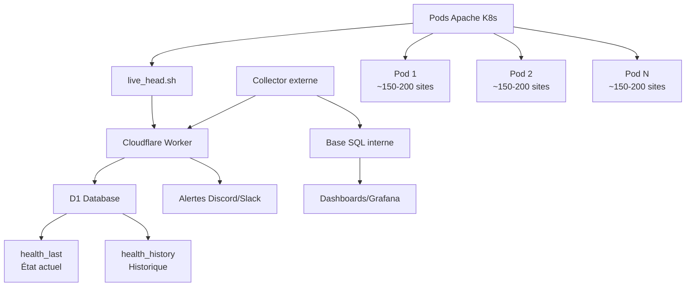

# 📡 live_head

[](LICENSE)
[](https://workers.cloudflare.com/)
[](https://kubernetes.io/)

> **Monitoring HTTP haute performance pour 30 000 sites WordPress** - Surveillance distribuée avec alertes en temps réel

## 📋 Table des matières

- [✨ Fonctionnalités](#-fonctionnalités)
- [🏗️ Architecture](#️-architecture)
- [⚡ Installation rapide](#-installation-rapide)
- [🌐 API Endpoints](#-api-endpoints)
- [🤖 Configuration des Pods](#-configuration-des-pods)
- [⏱️ Planification (CronJob)](#️-planification-cronjob)
- [🗄️ Base de données (D1)](#️-base-de-données-d1)
- [📊 Exemples de requêtes SQL](#-exemples-de-requêtes-sql)
- [🛠️ Maintenance](#️-maintenance)
- [💰 Coûts](#-coûts)
- [🔧 Troubleshooting](#-troubleshooting)

## ✨ Fonctionnalités

- [x] **Monitoring distribué** - Surveillance de 30k+ sites WordPress via pods Kubernetes
- [x] **Détection fiable** - GET avec range (36% plus rapide que HEAD, détecte vraiment les erreurs)
- [x] **Alertes en temps réel** - Discord/Slack/webhook pour erreurs 5xx et redirections cross-domain
- [x] **Stockage optimisé** - Cloudflare D1 avec historique configurable
- [x] **API REST complète** - Endpoints pour consultation et intégration
- [x] **Faible coût** - ~5-10$/mois pour 30k sites (scan toutes les 30min)
- [x] **Métriques détaillées** - Latence, codes HTTP, redirections, ports

## 🏗️ Architecture



### Composants

| Composant | Rôle | Coût |
|-----------|------|------|
| **Pods Apache K8s** | Hébergement ~150-200 sites WP chacun | Inclus infra |
| **live_head.sh** | Script de scan (GET avec range, normalise 206→200) | - |
| **Cloudflare Worker** | API + alertes + stockage | $5/mois |
| **D1 Database** | Stockage états + historique | Inclus |
| **Collector externe** | Extraction données pour BI | - |

### Métriques collectées

- ✅ **Code HTTP** (200, 301, 404, 500...)
- ✅ **Latence** (millisecondes)
- ✅ **Port** de réponse
- ✅ **Redirections** avec détection cross-domain
- ✅ **Timestamp** précis

## ⚡ Installation rapide

### 1. Déploiement Cloudflare

```bash
# Appliquer les migrations D1
wrangler d1 migrations apply live-head-db --remote

# Déployer le Worker
wrangler deploy
```

### 2. Test de fonctionnement

```bash
# Vérifier le Worker
curl -s https://<worker>/health

# Test d'envoi de données
TOKEN="mon_token_secret"
curl -sX POST https://<worker>/push \
  -H "Authorization: Bearer $TOKEN" \
  -H "Content-Type: application/json" \
  -d '{"site":"site.com","status":301,"ms":12,"port":8080,"location":"https://www.site.com/","ts":1735647382000}'

# Lecture du dernier état
curl -s "https://<worker>/last?site=site.com" | jq
```

> ✅ Si tout fonctionne, vous devriez voir `{"ok":true}` pour health et des données pour le test.

## 🌐 API Endpoints

### `GET /health`
**Vérification de santé du Worker**
```bash
curl -s https://<worker>/health
# Réponse: {"ok": true}
```

---

### `POST /push`
**Envoi de métriques (1 mesure ou array)**

**Headers requis :**
- `Authorization: Bearer <token>`
- `Content-Type: application/json`

**Payload (mesure unique) :**
```json
{
  "site": "example.com",
  "status": 200,
  "ms": 18,
  "port": 8080,
  "ts": 1735648000000
}
```

**Payload (batch) :**
```json
[
  {"site":"site1.com","status":200,"ms":18,"port":8080,"ts":1735648000000},
  {"site":"site2.com","status":301,"ms":12,"port":8080,"location":"https://www.site2.com/","ts":1735648010000}
]
```

---

### `GET /last`
**Dernier état d'un site spécifique**

```bash
curl -s "https://<worker>/last?site=example.com" | jq
```

**Réponse :**
```json
{
  "ok": true,
  "site": "example.com",
  "data": {
    "s": 301,     // status
    "ms": 12,     // latence
    "p": 8080,    // port
    "l": "https://www.example.com/",  // location (si redirect)
    "x": 0,       // cross-domain flag (0=non, 1=oui)
    "t": 1735647382000  // timestamp
  }
}
```

---

### `GET /dump_last`
**Export complet des derniers états**

#### Paramètres de filtrage

| Paramètre | Description | Exemple |
|-----------|-------------|---------|
| `status` | Codes HTTP multiples | `status=500,403,301` |
| `cross` | Redirections cross-domain | `cross=1` ou `cross=true` |
| `since` | Depuis timestamp (ms) | `since=1735647382000` |
| `until` | Jusqu'à timestamp (ms) | `until=1735747382000` |
| `site_like` | Filtre SQL LIKE | `site_like=%25example.com` |
| `limit` | Nombre max (défaut: 1000, max: 5000) | `limit=200` |
| `offset` | Décalage pagination | `offset=1000` |
| `order` | Ordre tri (asc/desc, défaut: desc) | `order=asc` |

#### Exemples d'usage

```bash
# Tous les 500/403/301 récents
curl -s "https://<worker>/dump_last?status=500,403,301&limit=200" | jq

# Uniquement les redirections cross-domain
curl -s "https://<worker>/dump_last?cross=1" | jq

# Sites contenant "example.com"
curl -s "https://<worker>/dump_last?site_like=%25example.com" | jq

# Erreurs depuis hier
YESTERDAY=$(date -d "yesterday" +%s)000
curl -s "https://<worker>/dump_last?status=500,502,503&since=${YESTERDAY}" | jq
```

## 🤖 Configuration des Pods

### Script `/mnt/www/update/live_head.sh`

Créer le fichier suivant sur chaque pod :

```bash
#!/usr/bin/env bash

# Configuration
ROOT="/mnt/www"
PORT="8080"
LOCAL_IP="$(hostname -i | awk '{print $1}')"
WORKER_URL="https://live-head.restless-dust-dcc3.workers.dev/push"
AUTH_TOKEN="oROyVhmcMQ3W1ZjGs3CV798g0UJ9I4kHEulDgb76Tzru8t"

POD_INFO=$(basename /mnt/www/update/infra*-group* 2>/dev/null | head -n1)
POD_INFO="${POD_INFO:-unknown}"

LOG_FILE="/mnt/www/update/log/live_head-$(date +%Y%m%d-%H%M%S).log"
mkdir -p "$(dirname "$LOG_FILE")"

# Fonction pour tester un site
test_site() {
  local d="$1"
  read -r code time_total <<<"$(curl -sS \
    -H "Host: $d" -H "X-Forwarded-Proto: https" \
    --http1.1 --no-keepalive \
    --max-time 10 --connect-timeout 3 \
    --range 0-1024 \
    -o /dev/null \
    -w '%{http_code} %{time_total}' \
    "http://${LOCAL_IP}:${PORT}/" 2>/dev/null || echo "000 0")"
  
  # Normaliser le code 206 en 200 (Partial Content = OK)
  [[ "$code" == "206" ]] && code="200"
  
  ms="$(awk -v t="$time_total" 'BEGIN{printf("%d", t*1000)}')"
  ts="$(date +%s%3N)"
  
  printf '{"site":"%s","status":%d,"ms":%d,"pod":"%s","ts":%d}\n' \
    "$d" "$code" "$ms" "$POD_INFO" "$ts"
}

export -f test_site
export LOCAL_IP PORT POD_INFO

# Test en parallèle (2 simultanés)
cd "$ROOT"
results_file="/tmp/live_head_results_$$"
ls -d *.* 2>/dev/null | xargs -P 2 -I {} bash -c 'test_site "{}"' > "$results_file"

# Construire le payload
results=()
while IFS= read -r line; do
  [[ -n "$line" ]] && results+=("$line")
done < "$results_file"
rm -f "$results_file"

# Envoi API
payload="[ $(IFS=,; echo "${results[*]}") ]"
if curl -sS -X POST "$WORKER_URL" \
  --http1.1 --no-keepalive \
  -H "Authorization: Bearer $AUTH_TOKEN" \
  -H "Content-Type: application/json" \
  -d "$payload" >/dev/null 2>&1; then
  
  echo "[$(date '+%Y-%m-%d %H:%M:%S')] OK - ${#results[@]} sites envoyés ($POD_INFO)" >> "$LOG_FILE"
  echo "${#results[@]} sites"
else
  echo "[$(date '+%Y-%m-%d %H:%M:%S')] ERREUR API - ${#results[@]} sites ($POD_INFO)" >> "$LOG_FILE"
  echo "Erreur API"
fi
```

### Points clés du script

- **GET avec `--range 0-1024`** : Plus rapide et fiable que HEAD (36% plus rapide, détecte vraiment les erreurs)
- **Normalisation 206→200** : Le code 206 (Partial Content) est normalisé en 200
- **Parallélisation avec `xargs -P 2`** : Traite 2 sites simultanément pour optimiser le temps
- **Détection automatique du pod** : Via le fichier `/mnt/www/update/infra*-group*`
- **Logs locaux** : Stockés dans `/mnt/www/update/log/`

### Exécution manuelle

```bash
# Rendre exécutable
chmod +x /mnt/www/update/live_head.sh

# Test manuel
/mnt/www/update/live_head.sh
```

## ⏱️ Planification (CronJob)

### Option 1: Cron système

```bash
# Éditer crontab
crontab -e

# Ajouter : scan toutes les 30 minutes
*/30 * * * * /mnt/www/update/live_head.sh >> /var/log/live_head.log 2>&1
```

### Option 2: CronJob Kubernetes

```yaml
apiVersion: batch/v1
kind: CronJob
metadata:
  name: live-head-monitor
spec:
  schedule: "*/30 * * * *"  # Toutes les 30 minutes
  jobTemplate:
    spec:
      template:
        spec:
          containers:
          - name: monitor
            image: your-pod-image
            env:
            - name: WORKER_URL
              value: "https://your-worker.workers.dev/push"
            - name: AUTH_TOKEN
              valueFrom:
                secretKeyRef:
                  name: live-head-secret
                  key: auth-token
            command: ["/root/live_head.sh"]
          restartPolicy: OnFailure
```

## 🗄️ Base de données (D1)

### Commandes utiles

```bash
# Dernières entrées (état actuel)
wrangler d1 execute live-head-db --remote --command \
"SELECT site,status,ms,location,cross,ts FROM health_last ORDER BY ts DESC LIMIT 20;"

# Historique récent (si activé)
wrangler d1 execute live-head-db --remote --command \
"SELECT site,status,ms,ts FROM health_history ORDER BY ts DESC LIMIT 20;"

# Erreurs serveur (5xx)
wrangler d1 execute live-head-db --remote --command \
"SELECT site,status,ts FROM health_last WHERE status >= 500 ORDER BY ts DESC LIMIT 20;"

# Redirections cross-domain
wrangler d1 execute live-head-db --remote --command \
"SELECT site,status,location,ts FROM health_last WHERE cross=1 ORDER BY ts DESC LIMIT 20;"
```

### Structure des tables

| Table | Description | Colonnes principales |
|-------|-------------|---------------------|
| `health_last` | État actuel de chaque site | site, status, ms, port, location, cross, ts |
| `health_history` | Historique complet (optionnel) | site, status, ms, port, location, cross, ts |

## 📊 Exemples de requêtes SQL

Ces requêtes sont utilisables dans **Grafana**, **Metabase** ou tout outil BI.

### Taux d'erreurs 5xx par heure

```sql
SELECT strftime('%Y-%m-%d %H:00', ts/1000, 'unixepoch') AS heure,
       COUNT(*) AS erreurs
FROM health_history
WHERE status >= 500
GROUP BY heure
ORDER BY heure DESC;
```

### Latence moyenne par site (24h)

```sql
SELECT site, 
       AVG(ms) as latence_moyenne,
       COUNT(*) as nb_mesures
FROM health_history
WHERE ts >= strftime('%s','now','-1 day')*1000
GROUP BY site
ORDER BY latence_moyenne DESC
LIMIT 50;
```

### Top 10 sites en erreurs

```sql
SELECT site, 
       COUNT(*) as nb_erreurs,
       AVG(ms) as latence_moyenne
FROM health_history
WHERE status >= 500
GROUP BY site
ORDER BY nb_erreurs DESC
LIMIT 10;
```

### Sites avec redirections cross-domain

```sql
SELECT site,
       status,
       location,
       COUNT(*) as occurrences
FROM health_history
WHERE cross = 1
GROUP BY site, status, location
ORDER BY occurrences DESC;
```

## 🛠️ Maintenance

### Désactiver l'historique

```bash
# Définir la variable d'environnement
wrangler secret put HISTORY_ENABLED
# Entrer la valeur : 0
```

### Nettoyage automatique

```bash
# Supprimer l'historique > 30 jours
wrangler d1 execute live-head-db --remote --command \
"DELETE FROM health_history WHERE ts < strftime('%s','now','-30 days')*1000;"

# Vérifier l'espace utilisé
wrangler d1 execute live-head-db --remote --command \
"SELECT COUNT(*) as total_history FROM health_history;"
```

### Monitoring du Worker

```bash
# Vérifier les logs
wrangler tail

# Statistiques d'usage
wrangler d1 execute live-head-db --remote --command \
"SELECT COUNT(*) as sites_monitores FROM health_last;"
```

## 💰 Coûts

### Estimation mensuelle Cloudflare

| Service | Limite gratuite | Coût dépassement | Notre usage (30k sites, 30min) |
|---------|----------------|------------------|--------------------------------|
| **Workers** | 100k req/jour | $5/mois (10M req + 30M ms CPU) | ~5$/mois |
| **D1** | 5M lectures, 100k écritures | $0.001/k après limite | Inclus dans gratuit |
| **KV** | ❌ Désactivé | $5/M écritures | Trop cher |

**Total estimé : 5-10 $/mois** 📊

### Comparaison alternatives

| Solution | Coût mensuel (30k sites) | Avantages | Inconvénients |
|----------|-------------------------|-----------|---------------|
| **live_head** | $5-10 | Edge computing, faible latence | Limité Cloudflare |
| **Datadog** | $500-1000+ | Fonctionnalités avancées | Très cher |
| **UptimeRobot** | $200-500 | Interface GUI | Limité, pas de bulk |
| **Pingdom** | $400-800 | Établi, fiable | Cher, pas distribué |

## 🔧 Troubleshooting

### Problèmes courants

#### Worker ne répond pas
```bash
# Vérifier déploiement
wrangler whoami
wrangler dev  # Test local

# Vérifier logs
wrangler tail
```

#### Erreur d'authentification
```bash
# Vérifier token
curl -v -H "Authorization: Bearer $AUTH_TOKEN" https://<worker>/health
```

#### Pods ne peuvent pas joindre le Worker
```bash
# Test connectivité réseau
curl -v https://<worker>/health

# Vérifier variables d'environnement
echo $WORKER_URL $AUTH_TOKEN
```

#### Base de données pleine
```bash
# Vérifier usage D1
wrangler d1 info live-head-db

# Nettoyer historique
wrangler d1 execute live-head-db --remote --command \
"DELETE FROM health_history WHERE ts < strftime('%s','now','-7 days')*1000;"
```

### Debug du script

```bash
# Mode debug
set -x
/root/live_head.sh

# Vérifier un site spécifique
probe_one "example.com"
echo "$payload"
```

---

## 🤝 Contributing

Les contributions sont les bienvenues ! Voici comment aider :

1. **Fork** le projet
2. **Créer** une branche feature (`git checkout -b feature/amazing-feature`)
3. **Commit** vos changements (`git commit -m 'Add amazing feature'`)
4. **Push** vers la branche (`git push origin feature/amazing-feature`)
5. **Ouvrir** une Pull Request

## 📄 License

Ce projet est sous licence MIT. Voir le fichier [LICENSE](LICENSE) pour plus de détails.

---

<div align="center">
  <sub>Built with ❤️ for monitoring 30k+ WordPress sites</sub>
</div>
